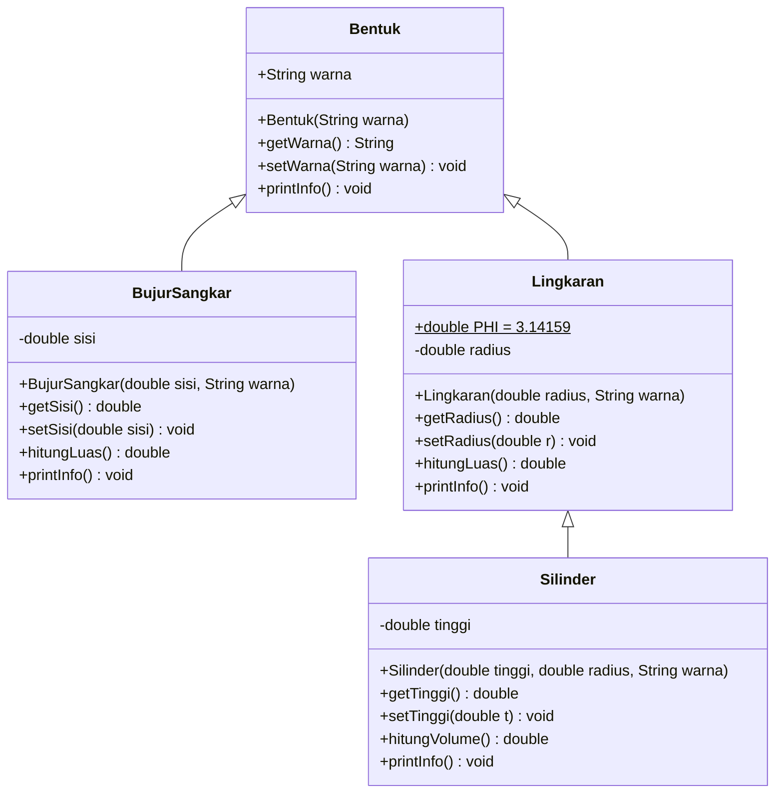
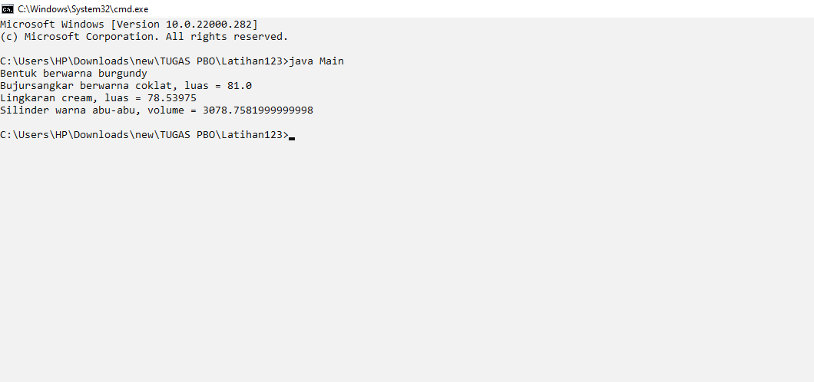

<div align="center">

# 🔷 Bentuk Geometri — Pewarisan (Inheritance) di Java 🔶

**Latihan PBO: dari `Bentuk` sampai `Silinder`, semuanya diwariskan dengan rapi.**


</div>

---

## 👤 Identitas

| | |
|---|---|
| **Nama** | Sovia Rovana Fikri |
| **NIM** | F1D02510027|
| **Kelas** | B |
| **Mata Kuliah** | Pemrograman Berorientasi Objek (PBO) |

---

## 📖 Deskripsi

Proyek ini adalah latihan **Pemrograman Berorientasi Objek (PBO)** dengan Java yang mendemonstrasikan:

- 🧬 **Inheritance (pewarisan)** — `BujurSangkar` dan `Lingkaran` mewarisi `Bentuk`, lalu `Silinder` mewarisi `Lingkaran`.
- 🔒 **Encapsulation** — atribut `private` diakses lewat *getter* dan *setter*.
- 🎭 **Polymorphism** — setiap kelas meng-*override* method `printInfo()` dengan perilakunya sendiri.
- 🔗 **`super`** — pemanggilan konstruktor kelas induk.

---

## 🧩 Struktur Kelas



---

## 🎨 Daftar Bentuk

| Kelas | Induk | Warna | Parameter | Rumus |
|---|---|---|---|---|
| `Bentuk` | — | 🍷 burgundy | `warna` | — |
| `BujurSangkar` | `Bentuk` | 🟤 coklat | `sisi = 9` | `Luas = sisi × sisi` |
| `Lingkaran` | `Bentuk` | 🥛 cream | `radius = 5` | `Luas = π × r²` (π = 3.14159) |
| `Silinder` | `Lingkaran` | 🩶 abu-abu | `tinggi = 20`, `radius = 7` | `Volume = luas alas × tinggi` |

---

## 📁 Struktur Folder

```
📦 Latihan123
 ┣ 📜 Bentuk.java
 ┣ 📜 BujurSangkar.java
 ┣ 📜 Lingkaran.java
 ┣ 📜 Silinder.java
 ┣ 📜 Main.java
 ┗ 🖼️ hasil.png
```

---

## 🚀 Cara Menjalankan

**Prasyarat:** sudah terpasang [JDK](https://adoptium.net/) (Java Development Kit).

```bash
# 1. Clone repository
git clone https://github.com/<username>/<nama-repo>.git
cd <nama-repo>

# 2. Compile semua file
javac *.java

# 3. Jalankan program
java Main
```

---

## 🖥️ Hasil Output



```text
Bentuk berwarna burgundy
Bujursangkar berwarna coklat, luas = 81.0
Lingkaran cream, luas = 78.53975
Silinder warna abu-abu, volume = 3078.7581999999998
```

### 🔍 Penjelasan Perhitungan

- **Bujursangkar:** 9 × 9 = **81.0**
- **Lingkaran:** 3.14159 × 5 × 5 = **78.53975**
- **Silinder:** (3.14159 × 7 × 7) × 20 = 153.93791 × 20 = **3078.7582**
  (tampil `3078.7581999999998` karena sifat presisi bilangan `double` di Java)

---

## 🛠️ Teknologi

- ☕ Java (JDK 8+)
- 💻 Command Prompt / Terminal

---

<div align="center">

⭐ Kalau repo ini membantu, jangan lupa kasih **star**! ⭐

Dibuat dengan ☕ dan semangat belajar PBO

</div>
